# Sanford.Multimedia.Midi.Core — Static Architecture

## Overview

`Sanford.Multimedia.Midi.Core` is a comprehensive .NET library for MIDI I/O, sequencing, and message handling on Windows. It wraps the Win32 Multimedia (WinMM) API and provides high-level abstractions for MIDI devices, messages, clocks, sequences, and event pipelines.

The library is organized in **6 namespaces** (layers):

| Namespace | Responsibility |
|---|---|
| `Sanford.Multimedia.Midi` | MIDI devices, messages, clocks, sequencing, processing |
| `Sanford.Multimedia` | Base device abstraction, error handling, music theory |
| `Sanford.Multimedia.Timers` | High-resolution timer abstraction |
| `Sanford.Threading` | Asynchronous delegate queue and scheduler |
| `Sanford.Collections` | Mutable data structures (Deque, PriorityQueue, SkipList) |
| `Sanford.Collections.Immutable` | Immutable data structures (Array, ArrayList, Stack, SortedList, RandomAccessList) |

---

## Namespace Dependency Graph

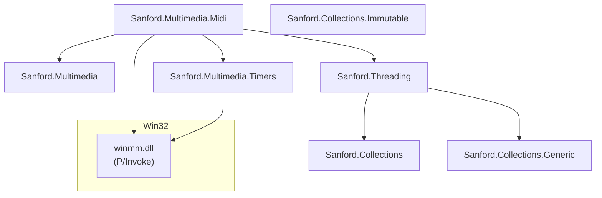

---

## 1. Device Layer

### Device Hierarchy

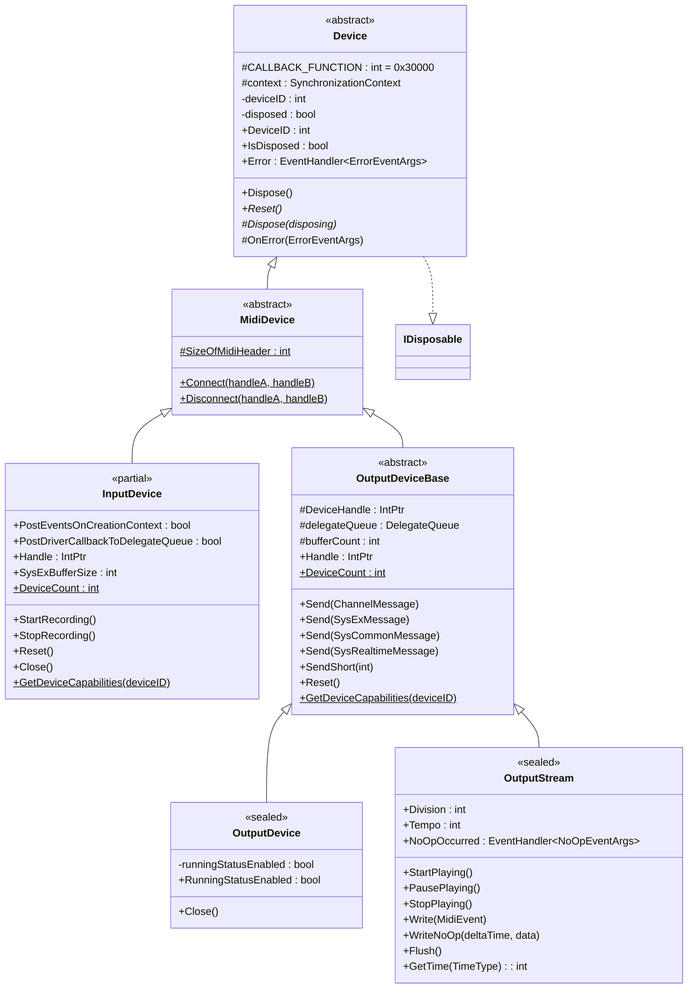

### Device Capabilities

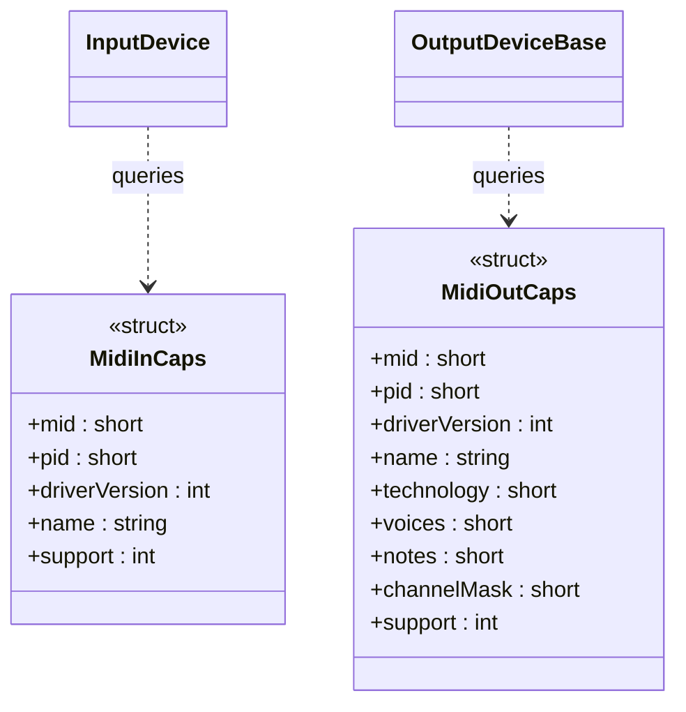

### Exception Hierarchy

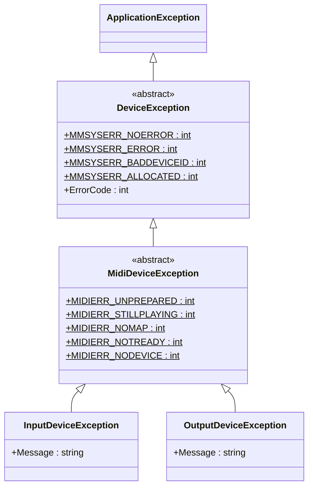

---

## 2. Message Layer

### Message Type Hierarchy

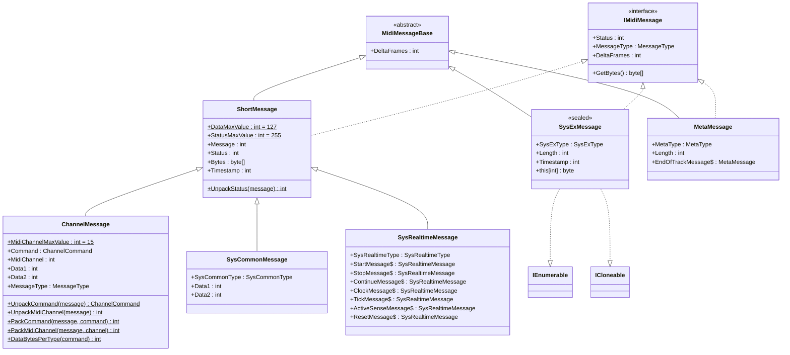

### Enumerations

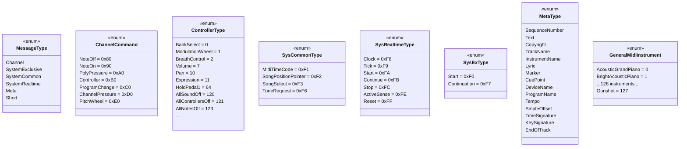

### Message Builders

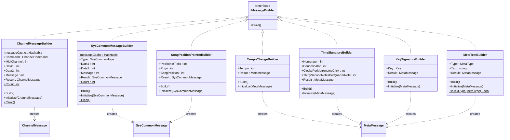

### MidiHeader (Win32 Interop)

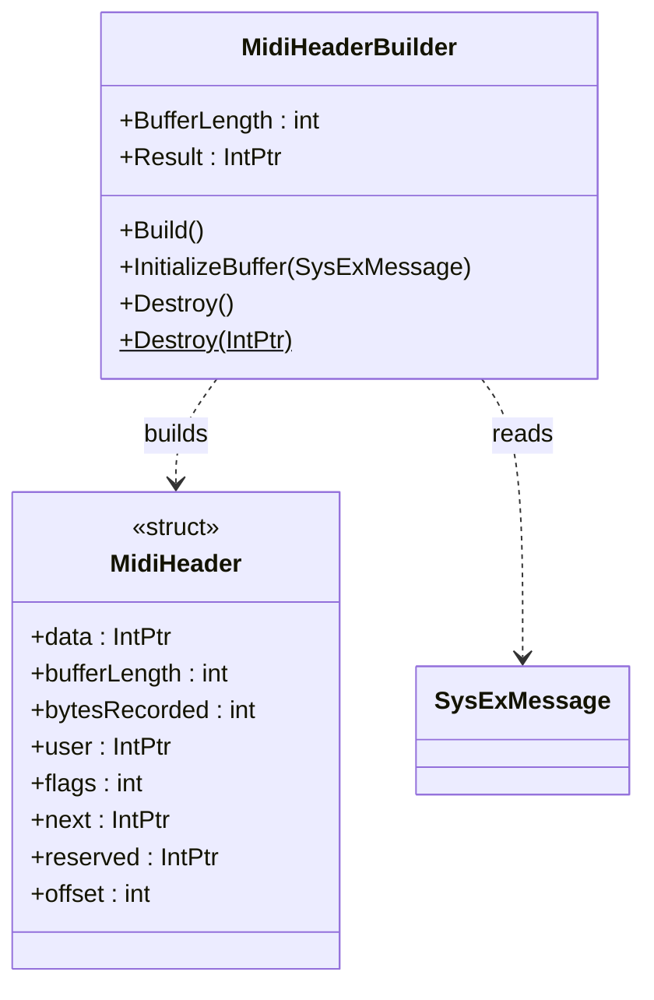

---

## 3. Event Args Layer

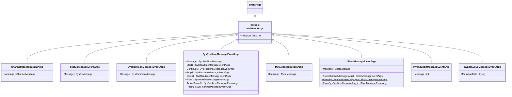

---

## 4. InputDevice Events

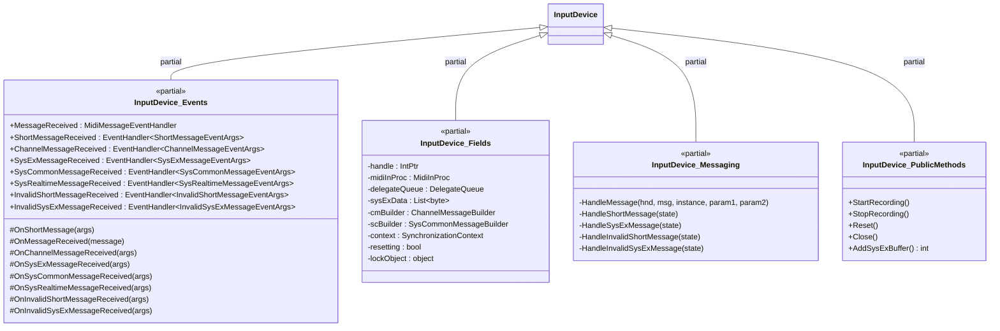

---

## 5. Clock and Timing Layer

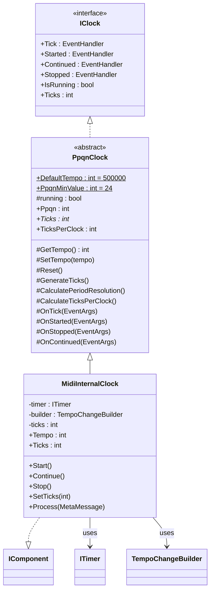

### Timer Abstraction

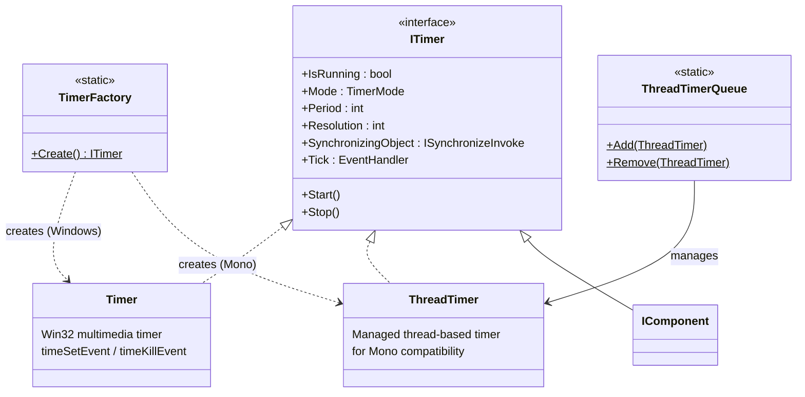

---

## 6. Sequencing Layer

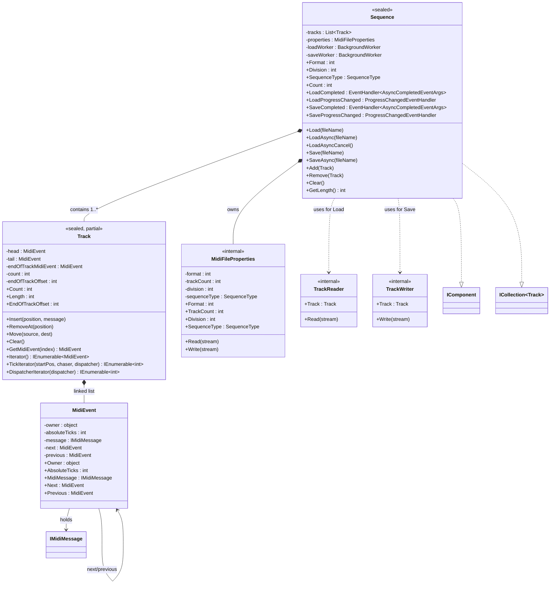

### Sequencer

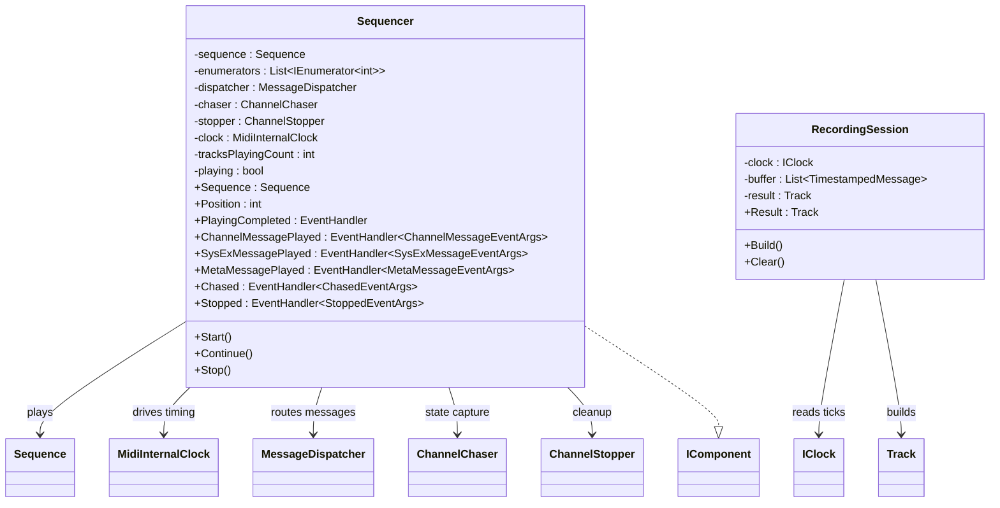

---

## 7. Processing Layer

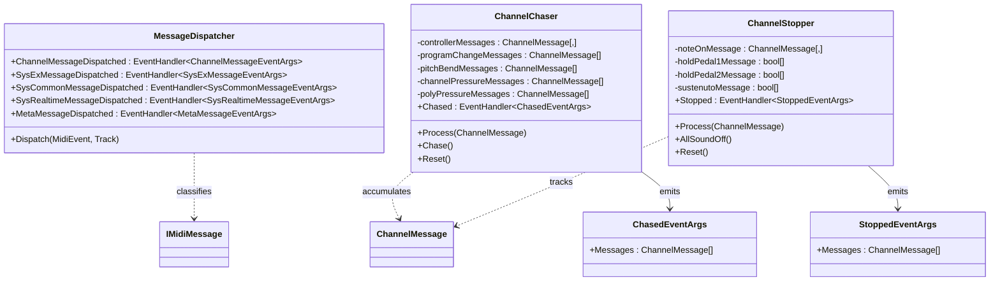

---

## 8. MidiEvents Pipeline

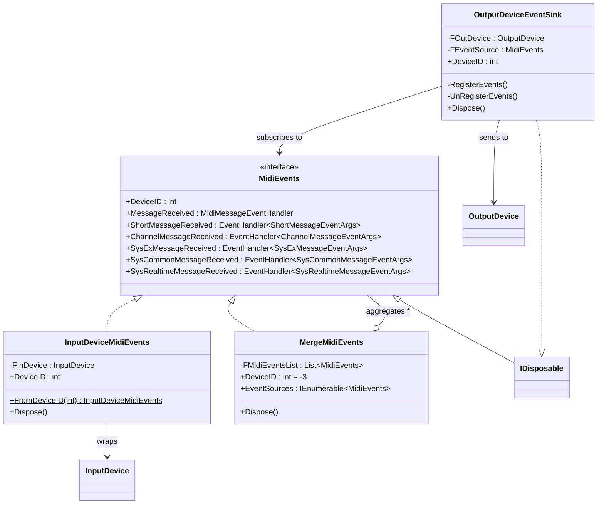

---

## 9. Threading Layer

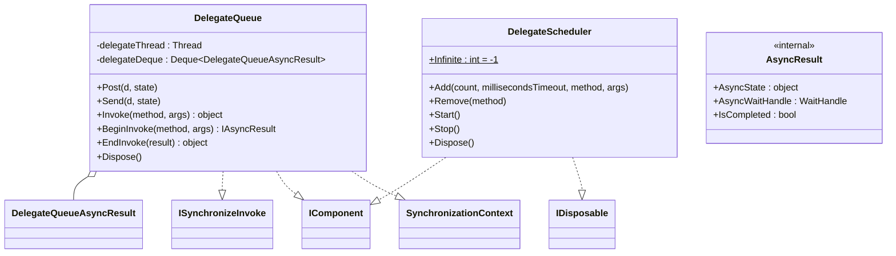

---

## 10. Collections Layer

### Mutable Collections

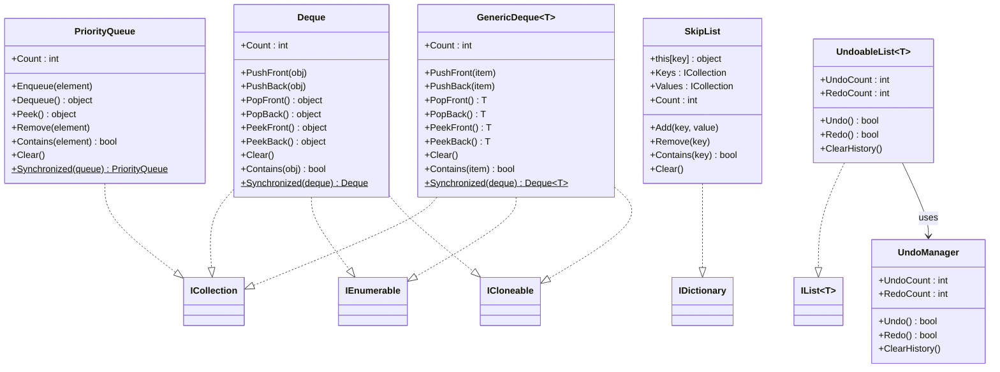

### Immutable Collections

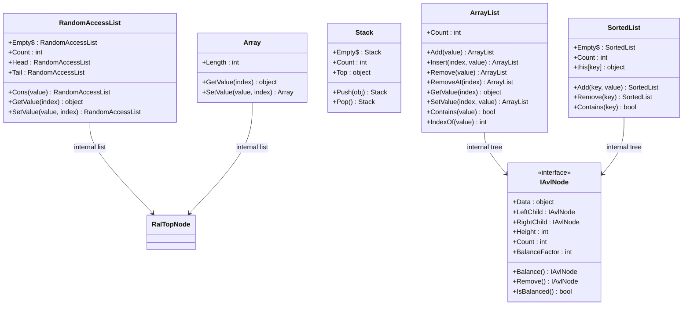

---

## 11. Utility Classes

```mermaid
classDiagram
    class MidiNoteConverter {
        <<sealed>>
        +NoteIDMinValue : int = 0$
        +NoteIDMaxValue : int = 127$
        +NoteToFrequency(noteID) double$
        +NoteToName(noteID) string$
    }

    class ControlChangesNames {
        <<struct>>
        +Names : string[]$
    }

    class Key {
        <<enum>>
        (Music key signatures)
    }

    class Note {
        <<enum>>
        (Musical note names)
    }
```

---

## File Organization by Namespace

```mermaid
graph LR
    subgraph Sanford.Multimedia.Midi
        direction TB
        subgraph Device Classes
            MD[MidiDevice.cs]
            MDE_f[MidiDeviceException.cs]
            MH[MidiHeader.cs]
            MHB[MidiHeaderBuilder.cs]
            subgraph InputDevice
                ID_cs[InputDevice.cs]
                ID_con[InputDevice.Construction.cs]
                ID_ev[InputDevice.Events.cs]
                ID_fld[InputDevice.Fields.cs]
                ID_msg[InputDevice.Messaging.cs]
                ID_prop[InputDevice.Properties.cs]
                ID_pub[InputDevice.PublicMethods.cs]
                ID_w32[InputDevice.Win32.cs]
                MIC[MidiInCaps.cs]
            end
            subgraph OutputDevice
                ODB[OutputDeviceBase.cs]
                OD[OutputDevice.cs]
                OS[OutputStream.cs]
                MOC[MidiOutCaps.cs]
                NOE[NoOpEventArgs.cs]
            end
        end
        subgraph Messages
            SM[ShortMessage.cs]
            CM[ChannelMessage.cs]
            SCM[SysCommonMessage.cs]
            SRM[SysRealtimeMessage.cs]
            SXM[SysExMessage.cs]
            MM_f[MetaMessage.cs]
            CCN[ControlChangesNames.cs]
            MDISP[MessageDispatcher.cs]
            subgraph Builders
                CMB[ChannelMessageBuilder.cs]
                SCMB[SysCommonMessageBuilder.cs]
                TCB[TempoChangeBuilder.cs]
                TSB[TimeSignatureBuilder.cs]
                KSB[KeySignatureBuilder.cs]
                MTB[MetaTextBuilder.cs]
                SPPB[SongPositionPointerBuilder.cs]
            end
            subgraph MidiEvents
                ME[MidiEvents.cs]
                IDME[InputDeviceMidiEvents.cs]
                MME[MergeMidiEvents.cs]
                ODES[OutputDeviceEventSink.cs]
            end
            subgraph EventArgs
                MAE[MidiEventArgs.cs]
                CMEA[ChannelMessageEventArgs.cs]
                SXEA[SysExMessageEventArgs.cs]
                SCMEA[SysCommonMessageEventArgs.cs]
                SREA[SysRealtimeMessageEventArgs.cs]
                MMEA[MetaMessageEventArgs.cs]
                SMEA[ShortMessageEventArgs.cs]
                ISEA[InvalidShortMessageEventArgs.cs]
                ISXEA[InvalidSysExMessageEventArgs.cs]
            end
        end
        subgraph Clocks
            IC[IClock.cs]
            PC[PpqnClock.cs]
            MIC_f[MidiInternalClock.cs]
        end
        subgraph Sequencing
            SEQ[Sequence.cs]
            SEQR[Sequencer.cs]
            MEV[MidiEvent.cs]
            MFP[MidiFileProperties.cs]
            RS[RecordingSession.cs]
            subgraph Track
                T[Track.cs]
                TI[Track.Iterators.cs]
                TT[Track.Test.cs]
                TR[TrackReader.cs]
                TW[TrackWriter.cs]
            end
        end
        subgraph Processing
            CC[ChannelChaser.cs]
            CS[ChannelStopper.cs]
            CEA[ChasedEventArgs.cs]
            SEA[StoppedEventArgs.cs]
        end
        GM[GeneralMidi.cs]
        MNC[MidiNoteConverter.cs]
    end

    subgraph Sanford.Multimedia
        DEV[Device.cs]
        DEVEX[DeviceException.cs]
        ERR[ErrorEventArgs.cs]
        KEY[Key.cs]
        NOTE[Note.cs]
    end

    subgraph Sanford.Multimedia.Timers
        IT[ITimer.cs]
        TIM[Timer.cs]
        TTH[ThreadTimer.cs]
        TTQ[ThreadTimerQueue.cs]
        TF[TimerFactory.cs]
        TIME[Time.cs]
    end

    subgraph Sanford.Threading
        DQ[DelegateQueue.cs]
        DQA[DelegateQueue.AsyncResult.cs]
        DS[DelegateScheduler.cs]
        DST[DelegateScheduler.Task.cs]
        AR[AsyncResult.cs]
        ICE[InvokeCompletedEventArgs.cs]
        PCE[PostCompletedEventArgs.cs]
    end

    subgraph Sanford.Collections
        DEQ[Deque.cs]
        PQ[PriorityQueue.cs]
        SL[SkipList.cs]
        subgraph Generic
            GD[GenericDeque.cs]
            GDS[GenericDeque.Synchronized.cs]
            GDE[GenericDeque.Enumerator.cs]
            GDN[GenericDeque.Node.cs]
            UL[UndoableList.cs]
            ULC[UndoableList.Commands.cs]
            ULT[UndoableList.Test.cs]
            UM[UndoManager.cs]
            ICMD[ICommand.cs]
        end
        subgraph Immutable
            ARR[Array.cs]
            AL[ArrayList.cs]
            STK[Stack.cs]
            ISL[SortedList.cs]
            RAL[RandomAccessList.cs]
            AVL[AvlNode.cs]
            IAVL[IAvlNode.cs]
            NAVL[NullAvlNode.cs]
            AVLE[AvlEnumerator.cs]
            RTN[RalTopNode.cs]
            RTREE[RalTreeNode.cs]
            RALE[RalEnumerator.cs]
        end
    end
```

---

## External Dependencies

```mermaid
graph TD
    SanfordCore["Sanford.Multimedia.Midi.Core"]
    WinMM["winmm.dll (P/Invoke)"]
    WinForms["System.Windows.Forms"]
    SysComp["System.ComponentModel"]
    SysThread["System.Threading"]

    SanfordCore --> WinMM
    SanfordCore --> WinForms
    SanfordCore --> SysComp
    SanfordCore --> SysThread
```


# Sanford.Multimedia.Midi.Core — Dynamic Architecture

## Overview

This document describes the main dynamic flows of the `Sanford.Multimedia.Midi.Core` library: MIDI input reception and event dispatching, MIDI output sending, clock/timing, sequence playback, recording, and the reactive MidiEvents pipeline.

---

## 1. MIDI Input — Message Reception

When a MIDI message arrives from a hardware device, the Windows multimedia driver invokes a callback. The `InputDevice` classifies the message and raises typed events.

```mermaid
sequenceDiagram
    participant HW as MIDI Hardware
    participant Driver as Win32 midiIn Driver
    participant CB as InputDevice.HandleMessage
    participant DQ as DelegateQueue
    participant Handler as InputDevice (handler)
    participant App as Application

    HW->>Driver: MIDI data
    Driver->>CB: callback(hnd, msg, param1, param2)

    alt MIM_DATA or MIM_MOREDATA (short message)
        alt PostDriverCallbackToDelegateQueue = true
            CB->>DQ: Post(HandleShortMessage, param)
            DQ->>Handler: HandleShortMessage(param)
        else PostDriverCallbackToDelegateQueue = false
            CB->>Handler: HandleShortMessage(param)
        end
    else MIM_LONGDATA (SysEx message)
        alt PostDriverCallbackToDelegateQueue = true
            CB->>DQ: Post(HandleSysExMessage, param)
            DQ->>Handler: HandleSysExMessage(param)
        else PostDriverCallbackToDelegateQueue = false
            CB->>Handler: HandleSysExMessage(param)
        end
    else MIM_ERROR (invalid short message)
        CB->>Handler: HandleInvalidShortMessage(param)
    else MIM_LONGERROR (invalid SysEx message)
        CB->>Handler: HandleInvalidSysExMessage(param)
    end

    Handler->>App: Raise typed event(s)
```

---

## 2. Short Message Classification

When `HandleShortMessage` receives raw data, it unpacks the status byte and dispatches to the correct event.

```mermaid
sequenceDiagram
    participant Handler as HandleShortMessage
    participant Builder as ChannelMessageBuilder
    participant SCBuilder as SysCommonMessageBuilder
    participant Events as InputDevice Events
    participant App as Application

    Handler->>Handler: Unpack status from message int
    Handler->>Events: OnShortMessage(ShortMessageEventArgs)
    Events->>App: ShortMessageReceived

    alt Channel message (NoteOn, NoteOff, CC, etc.)
        Handler->>Builder: Message = packed int
        Handler->>Builder: Build()
        Handler->>Events: OnMessageReceived(ChannelMessage)
        Handler->>Events: OnChannelMessageReceived(args)
        Events->>App: ChannelMessageReceived

    else SysCommon message (MTC, SongPosition, etc.)
        Handler->>SCBuilder: Message = packed int
        Handler->>SCBuilder: Build()
        Handler->>Events: OnMessageReceived(SysCommonMessage)
        Handler->>Events: OnSysCommonMessageReceived(args)
        Events->>App: SysCommonMessageReceived

    else SysRealtime message (Clock, Start, Stop, etc.)
        Handler->>Handler: Map status to SysRealtimeMessageEventArgs singleton
        Handler->>Events: OnMessageReceived(SysRealtimeMessage)
        Handler->>Events: OnSysRealtimeMessageReceived(args)
        Events->>App: SysRealtimeMessageReceived
    end
```

---

## 3. SysEx Message Accumulation

SysEx messages may arrive in multiple chunks. The `InputDevice` accumulates bytes until a complete message (0xF0 … 0xF7) is formed.

```mermaid
sequenceDiagram
    participant Driver as Win32 Driver
    participant Handler as HandleSysExMessage
    participant Buffer as sysExData (List of byte)
    participant Events as InputDevice Events
    participant App as Application

    Driver->>Handler: MIM_LONGDATA(headerPtr)
    Handler->>Handler: Marshal.PtrToStructure(MidiHeader)

    alt Not resetting
        loop For each recorded byte
            Handler->>Buffer: Add(byte)
        end

        alt Buffer starts with 0xF0 and ends with 0xF7
            Handler->>Handler: new SysExMessage(buffer)
            Handler->>Buffer: Clear()
            Handler->>Events: OnMessageReceived(SysExMessage)
            Handler->>Events: OnSysExMessageReceived(args)
            Events->>App: SysExMessageReceived
        end

        Handler->>Handler: AddSysExBuffer()
        Note right of Handler: Re-queue a buffer<br/>for the next chunk
    end

    Handler->>Handler: ReleaseBuffer(headerPtr)
```

---

## 4. Event Threading Model

The `InputDevice` supports two levels of threading control for event delivery.

```mermaid
flowchart TD
    A[Win32 Driver Callback] -->|"PostDriverCallbackToDelegateQueue?"| B{true}
    A --> C{false}

    B --> D[DelegateQueue Thread]
    C --> E[Driver Callback Thread]

    D -->|"PostEventsOnCreationContext?"| F{true}
    D --> G{false}
    E -->|"PostEventsOnCreationContext?"| F
    E --> G

    F --> H[SynchronizationContext.Post<br/>UI Thread]
    G --> I[Current Thread<br/>Lowest latency]

    H --> J[Application Event Handler]
    I --> J
```

---

## 5. MIDI Output — Sending Messages

### 5a. Short Messages (Channel, SysCommon, SysRealtime)

```mermaid
sequenceDiagram
    participant App as Application
    participant OutDev as OutputDevice
    participant Win32 as Win32 midiOutShortMsg
    participant HW as MIDI Hardware

    App->>OutDev: Send(ChannelMessage)
    OutDev->>OutDev: Extract packed int (message.Message)
    OutDev->>Win32: midiOutShortMsg(handle, message)
    Win32->>HW: MIDI short message
```

### 5b. SysEx Messages (Long Messages)

```mermaid
sequenceDiagram
    participant App as Application
    participant OutDev as OutputDeviceBase
    participant Builder as MidiHeaderBuilder
    participant Win32 as Win32 midiOut API
    participant DQ as DelegateQueue
    participant HW as MIDI Hardware

    App->>OutDev: Send(SysExMessage)
    OutDev->>Builder: InitializeBuffer(message)
    OutDev->>Builder: Build()
    Note right of Builder: Allocates unmanaged<br/>MidiHeader + data buffer

    OutDev->>Win32: midiOutPrepareHeader(handle, headerPtr)

    alt Prepare succeeded
        OutDev->>OutDev: bufferCount++
        OutDev->>Win32: midiOutLongMsg(handle, headerPtr)
        Win32->>HW: SysEx data

        Note right of Win32: Driver calls back MOM_DONE<br/>when send completes

        Win32->>OutDev: HandleMessage(MOM_DONE)
        OutDev->>DQ: Post(ReleaseBuffer, headerPtr)
        DQ->>OutDev: ReleaseBuffer(headerPtr)
        OutDev->>Win32: midiOutUnprepareHeader(handle, headerPtr)
        OutDev->>Builder: Destroy(headerPtr)
        OutDev->>OutDev: bufferCount--
    else Prepare failed
        OutDev->>Builder: Destroy()
        OutDev->>App: throw OutputDeviceException
    end
```

---

## 6. OutputStream — Streamed MIDI Playback

The `OutputStream` wraps the Win32 MIDI stream API for timed playback of MIDI events.

```mermaid
sequenceDiagram
    participant App as Application
    participant Stream as OutputStream
    participant Win32 as Win32 midiStream API
    participant HW as MIDI Hardware

    App->>Stream: new OutputStream(deviceID)
    Stream->>Win32: midiStreamOpen(handle, deviceID)

    App->>Stream: Division = ppqn
    Stream->>Win32: midiStreamProperty(MIDIPROP_TIMEDIV)

    App->>Stream: Tempo = microsPerBeat
    Stream->>Win32: midiStreamProperty(MIDIPROP_TEMPO)

    loop Write MIDI events
        App->>Stream: Write(MidiEvent)
        Stream->>Stream: Pack event into stream buffer
    end

    App->>Stream: Flush()
    Stream->>Win32: midiStreamOut(handle, headerPtr)

    App->>Stream: StartPlaying()
    Stream->>Win32: midiStreamRestart(handle)
    Win32->>HW: Timed MIDI output

    Note right of Win32: MOM_DONE callback<br/>when buffer completes
    Win32->>Stream: HandleMessage(MOM_DONE)
    Stream->>Stream: ReleaseBuffer()

    Note right of Win32: MOM_POSITIONCB callback<br/>for NOP markers
    Win32->>Stream: HandleMessage(MOM_POSITIONCB)
    Stream->>App: NoOpOccurred event

    App->>Stream: StopPlaying()
    Stream->>Win32: midiStreamStop(handle)
```

---

## 7. Clock and Timing

### 7a. MidiInternalClock Lifecycle

The `MidiInternalClock` extends `PpqnClock` and uses a multimedia `Timer` to generate tick events at PPQN resolution.

```mermaid
sequenceDiagram
    participant App as Application
    participant Clock as MidiInternalClock
    participant PpqnClock as PpqnClock (base)
    participant Timer as ITimer

    App->>Clock: new MidiInternalClock(timerPeriod)
    Clock->>PpqnClock: base(timerPeriod)
    PpqnClock->>PpqnClock: CalculatePeriodResolution()
    PpqnClock->>PpqnClock: CalculateTicksPerClock()
    Clock->>Timer: TimerFactory.Create()
    Clock->>Timer: Period = timerPeriod
    Clock->>Timer: subscribe Tick

    App->>Clock: Start()
    Clock->>Clock: ticks = 0
    Clock->>PpqnClock: Reset()
    Clock->>App: OnStarted()
    Clock->>Timer: Start()
    Clock->>Clock: running = true

    loop Timer fires periodically
        Timer->>Clock: Tick event
        Clock->>PpqnClock: GenerateTicks()
        PpqnClock->>PpqnClock: Accumulate fractionalTicks
        loop For each generated tick
            PpqnClock->>App: OnTick()
            PpqnClock->>PpqnClock: ticks++
        end
    end

    App->>Clock: Stop()
    Clock->>Timer: Stop()
    Clock->>Clock: running = false
    Clock->>App: OnStopped()
```

### 7b. Tempo Change Processing

```mermaid
sequenceDiagram
    participant Sequencer as Sequencer
    participant Clock as MidiInternalClock
    participant Builder as TempoChangeBuilder

    Sequencer->>Clock: Process(MetaMessage)

    alt MetaType == Tempo
        Clock->>Builder: Initialize(message)
        Clock->>Builder: Build()
        Clock->>Clock: Tempo = builder.Tempo
        Clock->>Clock: SetTempo(tempo)
        Note right of Clock: Recalculates tick<br/>generation rate
    end
```

---

## 8. Sequence Playback (Sequencer)

The `Sequencer` orchestrates playback of a `Sequence` (collection of `Track`s) by driving them with a `MidiInternalClock`.

```mermaid
sequenceDiagram
    participant App as Application
    participant Seq as Sequencer
    participant Clock as MidiInternalClock
    participant Tracks as Track[]
    participant Dispatcher as MessageDispatcher
    participant Chaser as ChannelChaser
    participant Stopper as ChannelStopper

    App->>Seq: Sequence = loadedSequence
    App->>Seq: Start()
    Seq->>Seq: Stop() (if playing)
    Seq->>Seq: Position = 0

    Seq->>Seq: Continue()
    loop For each Track in Sequence
        Seq->>Tracks: TickIterator(position, chaser, dispatcher)
        Seq->>Seq: Store enumerator
    end
    Seq->>Seq: tracksPlayingCount = Sequence.Count
    Seq->>Clock: Ppqn = sequence.Division
    Seq->>Clock: Continue()

    loop Clock tick events
        Clock->>Seq: Tick event

        loop For each track enumerator
            Seq->>Tracks: enumerator.MoveNext()
            Note right of Tracks: TickIterator yields when<br/>absoluteTicks matches clock

            alt MidiEvent ready
                Tracks->>Dispatcher: Dispatch(midiEvent, track)
                Dispatcher->>App: ChannelMessagePlayed / SysExMessagePlayed / MetaMessagePlayed
            end
        end
    end

    alt EndOfTrack meta message received
        Seq->>Seq: tracksPlayingCount--
        alt tracksPlayingCount == 0
            Seq->>Seq: Stop()
            Seq->>App: PlayingCompleted
        end
    end
```

---

## 9. Sequence Playback — Stop and Cleanup

```mermaid
sequenceDiagram
    participant App as Application
    participant Seq as Sequencer
    participant Clock as MidiInternalClock
    participant Stopper as ChannelStopper

    App->>Seq: Stop()
    Seq->>Seq: playing = false
    Seq->>Clock: Stop()
    Seq->>Stopper: AllSoundOff()

    Stopper->>Stopper: Build NoteOff for all active notes
    Stopper->>Stopper: Build HoldPedal OFF messages
    Stopper->>Stopper: Build Sustenuto OFF messages
    Stopper->>App: Stopped event (StoppedEventArgs with messages)
```

---

## 10. Channel Chasing (Seek)

When playback starts from a position other than zero, the `ChannelChaser` captures the cumulative channel state (controllers, program changes, pitch bend) so the synth is in the correct state.

```mermaid
sequenceDiagram
    participant Track as Track.TickIterator
    participant Chaser as ChannelChaser
    participant Dispatcher as MessageDispatcher
    participant App as Application

    Note over Track, Chaser: Phase 1: Chase past events (before startPosition)

    loop Events before startPosition
        Track->>Chaser: Process(ChannelMessage)
        Note right of Chaser: Stores latest value for each<br/>controller, program, pitch, pressure
    end

    Chaser->>Chaser: Chase()
    Note right of Chaser: Emits accumulated state<br/>as an array of messages
    Chaser->>App: Chased event (ChasedEventArgs)

    Note over Track, Dispatcher: Phase 2: Normal playback from startPosition

    loop Events from startPosition onward
        Track->>Dispatcher: Dispatch(MidiEvent, track)
        Dispatcher->>App: ChannelMessagePlayed / MetaMessagePlayed / ...
    end
```

---

## 11. Recording Session

The `RecordingSession` captures incoming MIDI messages with timestamps relative to a running `IClock`.

```mermaid
sequenceDiagram
    participant App as Application
    participant Session as RecordingSession
    participant Clock as IClock
    participant Track as Track

    App->>Session: new RecordingSession(clock)

    loop While clock is running
        App->>Session: Record(ChannelMessage)
        Session->>Clock: get Ticks
        Session->>Session: buffer.Add(TimestampedMessage)
    end

    App->>Session: Build()
    Session->>Session: buffer.Sort(by timestamp)
    loop For each timestamped message
        Session->>Track: Insert(ticks, message)
    end

    App->>Session: get Result
    Session->>App: Track (with all recorded events)
```

---

## 12. MidiEvents Pipeline (Reactive Wiring)

The library provides an event-based pipeline for routing MIDI between input and output devices using the `MidiEvents` interface.

```mermaid
flowchart LR
    subgraph Input Sources
        ID1[InputDeviceMidiEvents<br/>Device A]
        ID2[InputDeviceMidiEvents<br/>Device B]
    end

    subgraph Merge
        MRG[MergeMidiEvents]
    end

    subgraph Output Sink
        SINK[OutputDeviceEventSink]
    end

    subgraph Hardware
        OUT[OutputDevice]
    end

    ID1 --> MRG
    ID2 --> MRG
    MRG --> SINK
    SINK --> OUT
```

### 12a. InputDeviceMidiEvents — Wrapping an InputDevice

```mermaid
sequenceDiagram
    participant App as Application
    participant Wrap as InputDeviceMidiEvents
    participant InDev as InputDevice

    App->>Wrap: new InputDeviceMidiEvents(inputDevice)
    Wrap->>InDev: StartRecording()

    Note over InDev, Wrap: Events are forwarded transparently

    InDev->>Wrap: ChannelMessageReceived
    Wrap->>App: ChannelMessageReceived

    InDev->>Wrap: SysExMessageReceived
    Wrap->>App: SysExMessageReceived
```

### 12b. OutputDeviceEventSink — Forwarding to OutputDevice

```mermaid
sequenceDiagram
    participant Source as MidiEvents source
    participant Sink as OutputDeviceEventSink
    participant OutDev as OutputDevice
    participant HW as MIDI Hardware

    Source->>Sink: ChannelMessageReceived
    Sink->>OutDev: Send(ChannelMessage)
    OutDev->>HW: MIDI short message

    Source->>Sink: SysExMessageReceived
    Sink->>OutDev: Send(SysExMessage)
    OutDev->>HW: MIDI SysEx

    Source->>Sink: SysRealtimeMessageReceived
    Sink->>OutDev: Send(SysRealtimeMessage)
    OutDev->>HW: MIDI realtime

    Source->>Sink: MessageReceived (generic)
    alt ShortMessage
        Sink->>OutDev: SendShort(message)
    else SysExMessage
        Sink->>OutDev: Send(sysExMessage)
    end
```

---

## 13. Sequence File I/O

### 13a. Loading a MIDI File

```mermaid
sequenceDiagram
    participant App as Application
    participant Seq as Sequence
    participant Props as MidiFileProperties
    participant Reader as TrackReader
    participant Track as Track

    App->>Seq: Load(fileName)
    Seq->>Seq: Open FileStream

    Seq->>Props: Read header chunk
    Props->>Props: Parse format, trackCount, division

    loop For each track in file
        Seq->>Reader: Read track chunk
        Reader->>Reader: Parse delta times + messages
        Reader->>Track: Insert(absoluteTicks, message)
        Seq->>Seq: tracks.Add(track)
    end

    Seq->>Seq: Close FileStream
```

### 13b. Saving a MIDI File

```mermaid
sequenceDiagram
    participant App as Application
    participant Seq as Sequence
    participant Props as MidiFileProperties
    participant Writer as TrackWriter
    participant Track as Track

    App->>Seq: Save(fileName)
    Seq->>Seq: Open FileStream

    Seq->>Props: Write header chunk
    Props->>Props: Write format, trackCount, division

    loop For each track in Sequence
        Seq->>Writer: Track = track
        Writer->>Track: Iterator()
        loop For each MidiEvent
            Writer->>Writer: Write delta time + message bytes
        end
        Writer->>Writer: Write EndOfTrack
    end

    Seq->>Seq: Close FileStream
```

### 13c. Async Loading

```mermaid
sequenceDiagram
    participant App as Application
    participant Seq as Sequence
    participant BGWorker as BackgroundWorker

    App->>Seq: LoadAsync(fileName)
    Seq->>BGWorker: RunWorkerAsync(fileName)

    BGWorker->>BGWorker: DoWork: Load(fileName)
    BGWorker->>Seq: ProgressChanged
    Seq->>App: LoadProgressChanged

    BGWorker->>Seq: RunWorkerCompleted
    Seq->>App: LoadCompleted
```

---

## 14. Message Builder Pattern

All message types are constructed through builder classes that maintain a cache for object reuse.

```mermaid
sequenceDiagram
    participant Caller as Caller
    participant Builder as ChannelMessageBuilder
    participant Cache as Message Cache
    participant Msg as ChannelMessage

    Caller->>Builder: Command = NoteOn
    Caller->>Builder: MidiChannel = 0
    Caller->>Builder: Data1 = 60
    Caller->>Builder: Data2 = 100

    Caller->>Builder: Build()
    Builder->>Builder: Pack into integer message
    Builder->>Cache: Lookup packed message

    alt Found in cache
        Cache-->>Builder: Existing ChannelMessage
    else Not in cache
        Builder->>Msg: new ChannelMessage(packed)
        Builder->>Cache: Store(packed, message)
    end

    Caller->>Builder: get Result
    Builder-->>Caller: ChannelMessage
```

---

## 15. MessageDispatcher — Event Routing

The `MessageDispatcher` classifies `IMidiMessage` instances and raises the appropriate typed event.

```mermaid
sequenceDiagram
    participant Caller as Caller
    participant Disp as MessageDispatcher
    participant App as Subscriber

    Caller->>Disp: Dispatch(MidiEvent, Track)
    Disp->>Disp: switch(message.MessageType)

    alt Channel
        Disp->>App: ChannelMessageDispatched
    else SystemExclusive
        Disp->>App: SysExMessageDispatched
    else SystemCommon
        Disp->>App: SysCommonMessageDispatched
    else SystemRealtime
        Disp->>App: SysRealtimeMessageDispatched
    else Meta
        Disp->>App: MetaMessageDispatched
    end
```

---

## Thread Summary

| Thread | Responsibility |
|---|---|
| **UI Thread** | Application event handlers when `PostEventsOnCreationContext = true` |
| **DelegateQueue Thread** | Processes Win32 driver callbacks off the driver thread (when `PostDriverCallbackToDelegateQueue = true`) |
| **Win32 Driver Callback** | Raw MIDI input callback from `midiInOpen`; raw MIDI output done callback from `midiOutOpen` |
| **Timer Thread** | `ITimer` (multimedia timer or `ThreadTimer`) fires periodic ticks for `MidiInternalClock` |
| **BackgroundWorker Thread** | Async file I/O for `Sequence.LoadAsync` / `Sequence.SaveAsync` |

---

## Message Type Hierarchy

```mermaid
classDiagram
    class IMidiMessage {
        <<interface>>
        +GetBytes() byte[]
        +Status int
        +MessageType MessageType
        +DeltaFrames int
    }

    class ShortMessage {
        +Message int
        +Status int
        +Bytes byte[]
        +Timestamp int
    }

    class ChannelMessage {
        +Command ChannelCommand
        +MidiChannel int
        +Data1 int
        +Data2 int
    }

    class SysCommonMessage {
        +SysCommonType SysCommonType
        +Data1 int
        +Data2 int
    }

    class SysRealtimeMessage {
        +SysRealtimeType SysRealtimeType
        +StartMessage$
        +StopMessage$
        +ClockMessage$
    }

    class SysExMessage {
        +Length int
        +SysExType SysExType
        +Timestamp int
    }

    class MetaMessage {
        +MetaType MetaType
        +Length int
        +EndOfTrackMessage$
    }

    IMidiMessage <|.. ShortMessage
    IMidiMessage <|.. SysExMessage
    IMidiMessage <|.. MetaMessage
    ShortMessage <|-- ChannelMessage
    ShortMessage <|-- SysCommonMessage
    ShortMessage <|-- SysRealtimeMessage
```
